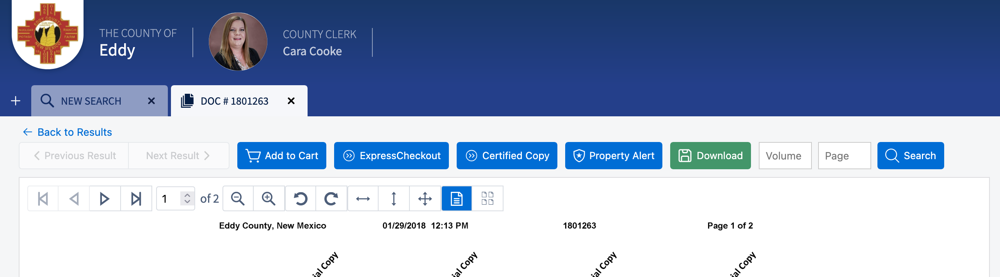

# GovOS Document Downloader

GovOS Document Downloader is a userscript that modifies the document preview pages on GovOS public records access platforms (e.g., PublicSearch.us) to enable downloading of watermarked PDF documents and quick instrument searching. The script compiles individual document preview images into a single PDF document.

> [!IMPORTANT]  
> **Document image previews must be available to compile a PDF document. If a particular county does not permit free public previews of watermarked pages, then this userscript will not work for that county.**

## Installation Instructions

1. Install a userscript web browser extension like [Violentmonkey](https://violentmonkey.github.io/) (recommended) or [Tampermonkey](https://www.tampermonkey.net/) to your web browser.
2. Open the [latest version](https://raw.githubusercontent.com/rplanier/govos-document-downloader/master/govos-document-downloader.user.js) of this userscript in your web browser. Your userscript web browser extension should prompt you to install the userscript.

## Usage Instructions

1. Visit the document preview page of any document on a GovOS public record access platform (e.g., `https://[county][state].publicsearch.us/doc/[document-number]`). The document preview page typically provides a watermarked document preview and a summary of the document details.
2. A green 'Download' button will now be inserted at the top of the document preview window.  Click the button and **wait for the document to compile and automatically download**.  Compiling the PDF may take up to one second per page.
3. A small web form next to the 'Download' button allows for quick searching of instruments by volume and page number.
4. If the 'Download' button or the search for do not automatically appear, refresh the document preview page to force the userscript to reload.
5. Upon clicking the 'Download' button, a prompt will ask you for the preferred filename.  The default filename is `[document-number]_V[volume] P[page]_[county] [state].pdf`.

## Screenshots

