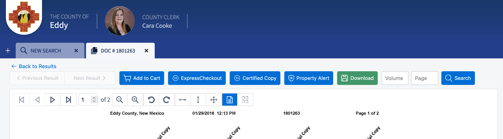

# Public Records Downloader

Public Records Downloader is a userscript that improves the document preview experience on county public records platforms. It adds a download button that compiles individual document page images into a single PDF, plus quick-search forms and other UI enhancements where applicable.

Currently supported platforms:

- **GovOS** — `*.publicsearch.us`
- **USLandRecords** — `i2j.uslandrecords.com` (and other subdomains)

> [!IMPORTANT]
> The script can only compile documents whose page images are publicly viewable. Some counties restrict free public previews; the script will not work for those counties.

> [!NOTE]
> This script merely compiles publicly available page images into a single PDF document. It does <ins>not</ins> remove watermarks, unlock paywalled content, or bypass any access restrictions.

## Installation Instructions

1. Install a userscript browser extension like [Violentmonkey](https://violentmonkey.github.io/) (recommended) or [Tampermonkey](https://www.tampermonkey.net/).
2. Open the [latest version](https://raw.githubusercontent.com/rplanier/public-records-downloader/master/public-records-downloader.user.js) of this userscript in your browser. Your userscript extension should prompt you to install it.

> [!CAUTION]
> Userscript extensions allow installed scripts to execute JavaScript on websites matching the configured URL patterns. <ins>Only install userscripts from trusted sources.</ins>

## Usage Instructions

### GovOS (publicsearch.us)

1. Visit a document preview page on a GovOS public record site (e.g., `https://[county][state].publicsearch.us/doc/[document-number]`).
2. A green **Download** button is inserted at the top of the document preview. Click it and **wait for the PDF to compile and automatically download**. Compilation can take up to a second per page.
3. A small search form next to the Download button allows quick lookup by instrument number, volume, and page.
4. Search results tables are automatically expanded to fill the available width.
5. If the button or search form does not appear, refresh the page.
6. Clicking Download prompts for a filename; the default is `[document-number]_V[volume] P[page]_[county] [state].pdf`.

### USLandRecords (uslandrecords.com)

1. Search for and open a document. Switch to the **View Images** tab.
2. A green **Download PDF** link is inserted next to "Print Document" in the image-viewer toolbar.
3. Click it; the script briefly switches to the **View Details** tab to read the document number and Book/Volume/Page (if not already visited), then walks all pages and compiles the PDF.
4. The default filename matches the GovOS pattern: `[document-number]_V[volume] P[page]_[county] [state].pdf`.
5. Progress is shown as a small toast in the top-right corner during the page walk and PDF compile.

## Screenshots

